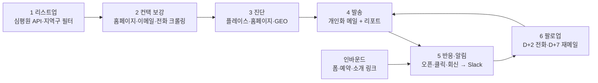
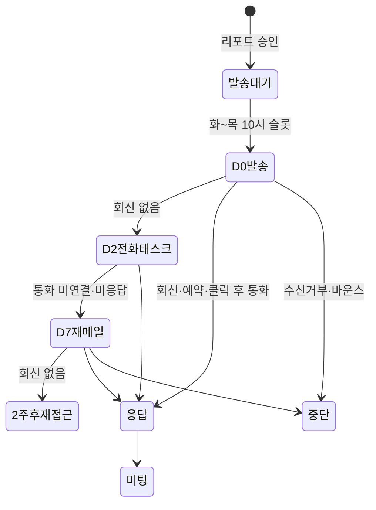
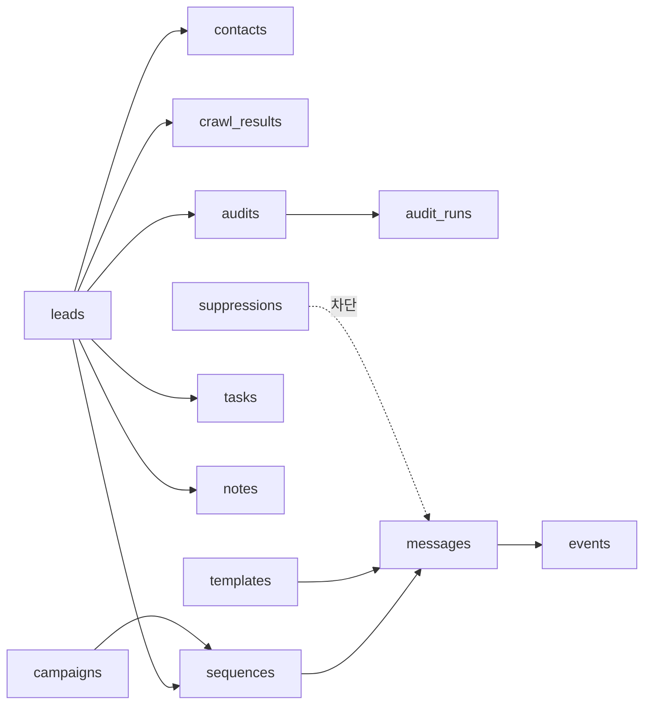

# 병의원 GEO 아웃리치 자동화 PRD

2026-09-22 · @Someone

## 1. 개요

솔버가 리캐치 같은 SaaS를 사지 않고 직접 만드는 병의원 아웃리치 도구다. 지역구별 병의원을 리스트업하고, 메일·전화·홈페이지를 자동 수집하고, 병원별 GEO 진단을 미끼로 소량 개인화 메일을 보낸 뒤, 회신·클릭·예약을 즉시 Slack으로 받는다. 1차 적용은 [정형외과 아웃리치 기획서](https://app.notion.com/p/3e3f50704f8c81a2bd36c91cda79a179)의 수도권 정형외과 40\~50곳이고, 첫 발송은 9/29(화) 오전 20곳이다.

**배경**

- AI 교육을 훅으로 잡았을 때는 리드가 생기지 않았다. 병원이 바로 체감하는 네이버플레이스·GEO 진단을 첫 컨택의 미끼로 쓴다.
- 빈 콜드메일과 대량 발송은 하지 않는다. 병원 이름이 박힌 진단 1장을 붙인 메일을 1차 20곳, 2차 20곳만 보낸다.
- 솔버는 자동화를 파는 팀이므로 이 도구 자체를 미팅에서 "저희가 실제로 쓰는 자동화"로 보여준다.

**지금 손으로 하면 생기는 문제**

- 리스트업과 이메일 찾기에 병원당 10\~15분이 든다. 40곳이면 하루가 사라진다.
- 진단 1장을 수작업으로 만들면 병원마다 같은 데이터 수집을 반복한다.
- 회신을 늦게 보면 온도가 식는다. D+2 전화, D+7 재메일 같은 팔로업이 빠진다.

**이번 라운드 목표 (기획서 기준)**

1. 40곳 컨택 → 응답 6곳(15%) → 미팅 4곳 → 제안 2곳 → 계약 1건
2. 새 컨택의 절반이 소개·공유 링크에서 오도록, 인바운드 장치(폼 → 예약 확정 → 알림)를 첫 발송 전에 세팅

**성공 지표**

| 지표 | 목표 | 측정 방법 |
| --- | --- | --- |
| 리스트업 소요 시간 | 필터 입력 후 50곳 리스트 30분 이내 | 실행 로그 타임스탬프 |
| 컨택 확보율 | 전화 100%, 홈페이지 80% 이상, 이메일 50% 이상 | 리드 테이블 집계 |
| 진단 리포트 생성 | 병원당 5분 이내 자동 생성, 사람 검수 1회 | 잡 실행 시간 |
| 알림 지연 | 회신 도착 → Slack 알림 60초 이내 | 메일 수신 시각 vs 알림 시각 |
| 발송 품질 | 바운스율 5% 미만, 스팸 신고 0건 | Gmail 발송 로그 |
| 팔로업 누락 | 0건 (모든 미응답 리드에 D+2·D+7 태스크 자동 생성) | 태스크 테이블 |

## 2. 사용자와 핵심 시나리오

1차 사용자는 아웃리치 담당(상화) 한 명이고, 진단 데이터를 공급하는 강우와 알림을 받는 팀원이 보조 사용자다. 병원 측 원장·행정실장은 시스템을 직접 쓰지 않고 메일·리포트·예약 링크만 본다.

| 사용자 | 하는 일 | 필요한 화면·기능 |
| --- | --- | --- |
| 아웃리치 담당 (상화) | 타겟 조건 입력, 리드 검수, 메일 승인·발송, 회신 대응, 전화 팔로업, 미팅 주선 | 리드 테이블, 캠페인 승인 큐, 인박스, 태스크 목록, Slack 알림 |
| 데이터 담당 (강우) | 네이버플레이스 순위·리뷰 수집 스크립트 운영, 진단 항목 공급 | 진단 데이터 입력 API 또는 CSV 업로드, 진단 재실행 |
| 팀원·송원장 | 미팅 일정 확인, 리드 현황 주간 확인 | Slack 알림, 주간 현황 요약 |
| 병원 원장·행정실장 | 메일 열람, 진단 리포트 확인, 30분 미팅 예약 | 진단 리포트 페이지, 예약 링크, 수신거부 링크 |

**핵심 시나리오**

1. 리스트업: "서울·경기 정형외과, 개원 2\~7년차, 의사 2\~5명"을 입력하면 후보 병원이 Tier와 함께 테이블에 뜬다.
2. 컨택 보강: 병원마다 전화·홈페이지·이메일·문의폼 URL이 자동으로 채워지고, 이메일이 없는 곳은 "전화 우선"으로 표시된다.
3. 진단: 병원마다 플레이스 순위·리뷰·홈페이지·GEO 언급 여부가 수집되고, 1장짜리 진단 리포트가 자동으로 만들어진다.
4. 발송: 담당이 개인화된 메일 초안을 검수·승인하면 화\~목 오전 10시에 20통 단위로 나간다. 리포트는 첨부와 링크로 함께 간다.
5. 반응: 원장이 메일을 열거나 링크를 누르거나 회신하면 60초 안에 Slack에 병원명·요약·다음 액션이 뜬다.
6. 팔로업: 미응답 리드에는 D+2 전화 태스크(스크립트 포함)와 D+7 재메일이 자동으로 잡히고, 회신·예약·수신거부가 오면 시퀀스가 멈춘다.
7. 인바운드: 소개 링크·폼으로 들어온 문의는 예약 확정과 동시에 리드 테이블에 UTM 경로와 함께 기록된다.

## 3. 시스템 구성

수집 → 보강 → 진단 → 발송 → 반응·알림 → 팔로업의 6단계 파이프라인이고, 모든 단계가 하나의 리드 레코드를 갱신한다. 앞 3단계는 배치 잡, 뒤 3단계는 이벤트 기반으로 돈다.



1\~3단계는 담당이 버튼 한 번으로 돌리는 배치이고, 4단계는 사람 승인을 거치며, 5\~6단계는 Gmail·폼·캘린더 이벤트가 트리거한다.

| 단계 | 입력 | 출력 | 실행 방식 |
| --- | --- | --- | --- |
| 1 리스트업 | 지역(시도·시군구), 종별, 진료과, 개원연차, 의사 수 | 후보 병원 목록 + Tier | 배치, 수 분 |
| 2 컨택 보강 | 병원명·주소·홈페이지 URL | 이메일, 전화, 문의폼 URL, 대표자, 진료시간, 홈페이지 요약 | 배치, 도메인당 요청 간격 2초 |
| 3 진단 | 병원 레코드 + 플레이스 데이터(강우) | 진단 점수, 개선 포인트 3개, 리포트 PDF·링크 | 배치, 병원당 5분 이내 |
| 4 발송 | 승인된 리드 + 템플릿 + 리포트 | Gmail 발송, 추적 링크, 시퀀스 등록 | 예약 발송, 화\~목 10시 |
| 5 반응·알림 | Gmail 수신, 클릭·오픈 이벤트, 폼 제출, 예약 확정 | 회신 분류, Slack 알림, 리드 상태 갱신 | 이벤트, 60초 이내 |
| 6 팔로업 | 리드 상태 + 시퀀스 규칙 | 전화 태스크, 재메일 예약, 2주 후 재접근 | 스케줄러, 매일 09시 |

## 4. 기능 요구사항 ① 지역구별 병의원 리스트업·분류

리스트업의 원천은 크롤링이 아니라 심평원 공공 API다. 시도·시군구·종별·진료과목 조건으로 후보를 뽑고, 개원연차·의사 수·플레이스 지표로 Tier를 매긴다. 요양기관이 심평원에 신고한 데이터라 전화·주소·개설일은 전 건 확보된다.

**데이터 원천**

| 원천 | 가져오는 항목 | 방식 | 비고 |
| --- | --- | --- | --- |
| [심평원 병원정보서비스](https://www.data.go.kr/data/15001698/openapi.do) | 요양기관명, 종별코드, 시도·시군구 코드, 주소, 전화번호, 홈페이지 URL, 개설일, 의사 수, 좌표, 암호화 요양기호(ykiho) | REST API `getHospBasisList`, 인증키 발급 후 사용 | 무료, 개발계정 일 10,000건. 지역·종별 코드는 opendata.hira.or.kr 코드조회 기준 |
| [심평원 의료기관별상세정보서비스](https://www.data.go.kr/data/15001699/openapi.do) | 진료과목, 전문과목별 전문의 수, 진료시간, 시설 정보 | ykiho로 개별 조회 | 정형외과 표방 여부와 전문의 수 판정에 사용 |
| 네이버 지도 검색 (강우 스크립트) | "지역명 + 정형외과" 노출 순위, 리뷰 수, 최근 리뷰 일자, 플레이스 정보 충실도 | 강우 수집 결과를 JSON/CSV로 입력 | 진단 데이터와 공용. 스크래핑 약관 리스크는 12절 |
| 메디킹 DB 엑셀 (선택) | 개원일, 오픈 예정 병원 | CSV 임포트만 | 리스트업 시간 단축용. 대량 메일 서비스는 쓰지 않음 |
| 수동 입력 | 소개 가능 여부, 소개자, 송원장 메모 | 테이블 직접 편집 | Tier 1 판정에 필수 |

**필터와 분류 규칙**

- 지역: 시도 → 시군구(지역구) → 읍면동 3단계. 1차 라운드는 서울·경기·인천만, 강릉·영동권은 제외 목록에 고정.
- 종별: 의원·병원·종합병원·상급종합·요양병원·치과·한의원 등 심평원 종별코드 그대로 보관. 1차는 의원·병원만 포함하고 종합병원 이상은 제외.
- 진료과목: 상세정보의 진료과목에 정형외과가 있는 곳. 재활의학과·마취통증의학과 병설 여부는 태그로 남긴다.
- 개원연차: 개설일 기준. 1년 미만 제외, 2\~7년차는 Tier 2 후보.
- 의사 수: 2\~5명이 Tier 2 조건. 전문과목별 전문의 수가 있으면 그 값을 우선한다.
- 직원 수: 의사 수와 물리치료실·도수치료 페이지 유무로 추정하고, 값 옆에 "추정"을 항상 표시한다.

| Tier | 조건 | 판정 방식 |
| --- | --- | --- |
| Tier 1 | 기존 원장·송원장이 소개 가능한 곳 | 수동 플래그 |
| Tier 2 | 개원 2\~7년차, 의사 2\~5명, 직원 10명 이상 추정 | 규칙 자동, 담당이 수정 가능 |
| Tier 3 | 플레이스 순위 10위 밖, 리뷰 30개 미만, 홈페이지 없음 또는 노후 | 진단 결과로 자동 |
| 제외 | 강릉·영동권, 종합병원 이상, 개원 1년 미만, 수신거부 이력 | 자동, 해제 불가 |

**리드 테이블 컬럼**

기획서의 시트 컬럼(병원명, 지역, 개원연도, 원장수, 직원수 추정, 플레이스순위, 리뷰수, 홈페이지, 소개가능, 담당, 상태, 다음액션)에 종별, 진료과목, 이메일, 전화, 문의폼 URL, Tier, GEO 점수, 최근 활동, 소개자, 유입 경로(UTM)를 더한다. 상태 값은 리스트업 → 진단완료 → 발송대기 → 발송 → 응답 → 미팅 → 제안 → 계약과 보류·수신거부로 고정한다.

**수용 기준**

- 조건 입력 후 50곳 리스트가 5분 안에 생성된다.
- 모든 레코드에 ykiho, 전화, 주소, 종별, 개설일이 채워진다. ykiho가 유니크 키다.
- Tier 규칙은 설정 파일로 바꿀 수 있고, 담당이 개별 레코드의 Tier를 덮어쓸 수 있다.
- 구글시트 CSV로 내보내기·가져오기가 된다. 1차 라운드는 시트가 원본일 수 있으므로 양방향 동기화 대신 "가져오기 시 ykiho 기준 병합"만 지원한다.
- 폐업·이전은 주 1회 API 재조회로 반영하고, 변경된 레코드는 Slack에 요약한다.

## 5. 기능 요구사항 ② 컨택 정보·홈페이지 크롤링

크롤러는 병원 홈페이지에서 이메일·문의폼·대표자·진료시간을 뽑고, 홈페이지 자체를 요약해 개인화 문장의 재료로 쓴다. 전화번호는 심평원 데이터에 이미 있으므로 크롤링은 이메일 확보와 홈페이지 진단이 목적이다.

**컨택 우선순위 (기획서 기준)**

원장 이메일 → 병원 대표 메일 → 홈페이지 문의폼 → 행정실장·원무과장 전화 순이다. 이메일이 하나도 없으면 리드 상태에 "전화 우선"을 자동 표시하고 7절의 메일 시퀀스 대신 전화 태스크만 만든다.

**수집 항목과 추출 규칙**

| 항목 | 어디서 | 추출 방법 | 검증 |
| --- | --- | --- | --- |
| 이메일 | 홈페이지 전 페이지의 `mailto:`, 푸터 텍스트, 개인정보처리방침 페이지(개인정보보호책임자 연락처), 채용·제휴 안내 페이지 | 정규식 + 난독화 패턴(`[at]`, 이미지 텍스트) 처리, 이미지는 OCR 선택 | MX 레코드 확인, 무료 메일(gmail 등)은 "개인 추정" 태그 |
| 문의폼 URL | 상단 메뉴·푸터의 문의/상담/제휴 링크, 네이버 폼·구글 폼 링크 | 링크 텍스트·URL 패턴 매칭 | 실제 응답 200 확인 |
| 대표자·원장명 | 푸터 사업자 정보(대표자), 의료진 소개 페이지 | 정규식 + Claude 추출 | 대표자와 의료진 소개가 다르면 둘 다 저장 |
| 진료시간·휴진일 | 진료안내 페이지, 심평원 상세정보 | 심평원 값을 기본으로, 홈페이지 값이 다르면 최신으로 표시 | 발송 시간 회피에 사용 |
| 진료 항목 | 도수치료, 체외충격파, 주사치료, 물리치료실, 입원·수술 안내 페이지 | 키워드 사전 매칭 | 직원 수 추정과 개인화 문장에 사용 |
| SNS·플레이스 링크 | 푸터·헤더의 네이버 블로그·플레이스·유튜브·인스타 링크 | URL 패턴 | 플레이스 URL은 진단 모듈로 전달 |
| 홈페이지 요약 | 메인·소개·의료진 페이지 본문 | Claude로 3문장 요약(특징, 강조 진료, 톤) | 개인화 첫 문장 생성 재료 |
| 홈페이지 기술 진단 | 응답 헤더, HTML, robots.txt, sitemap.xml | HTTPS 여부, 모바일 viewport, 응답 시간, 마지막 수정 추정, 구조화 데이터(schema.org) 유무 | 6절 진단 입력 |

**크롤러 동작 규칙**

- 홈페이지 URL은 심평원 값을 먼저 쓰고, 없거나 죽은 링크면 네이버 검색 결과의 공식 홈페이지 링크로 대체한다. 대체한 URL은 "자동 발견" 태그를 단다.
- robots.txt를 지키고, 도메인당 요청 간격 2초, 최대 30페이지, 깊이 2까지만 돈다. User-Agent에 솔버 연락처를 넣는다.
- "이메일무단수집거부", "전자우편 무단 수집 거부" 문구나 해당 페이지 링크가 있는 도메인에서는 이메일 자동 추출을 건너뛰고 리드에 "이메일 수동 확인"을 표시한다. 정보통신망법 제50조의2 때문이며 상세는 12절.
- 정적 HTML을 먼저 받고, 본문이 비어 있으면 Playwright로 렌더링한다. 병원 홈페이지는 이미지 메뉴·플래시 잔재가 많아 두 단계가 필요하다.
- 결과는 병원당 하나의 `crawl_results` 레코드로 저장하고, 원본 HTML은 30일 후 삭제한다. 개인정보는 필요한 항목만 남긴다.
- 재크롤링은 담당이 수동으로 실행하거나 60일 주기로 돈다.

**수용 기준**

- 50곳 기준 1시간 안에 완료된다(간격 2초, 병렬 도메인 5개).
- 이메일 확보율 50% 이상, 문의폼 또는 이메일 중 하나 확보율 80% 이상.
- 추출된 이메일은 발송 전 사람이 한 번 확인한다. 잘못된 병원명·원장명으로 나가는 메일이 0건이어야 한다.
- 크롤링 실패(차단, 타임아웃, 인증서 오류)는 사유 코드와 함께 리드에 남고, Slack 일일 요약에 건수가 포함된다.

## 6. 기능 요구사항 ③ GEO 진단 (메일 미끼)

진단은 병원 이름이 박힌 1장짜리 리포트다. 네이버플레이스·홈페이지·GEO(AI 검색 노출) 세 축을 점수화하고, "바로 손볼 3가지"와 예약 링크로 끝난다. 순위 보장이나 상승 효과는 쓰지 않고 현재 상태와 개선 구조만 보여준다.

**진단 축과 항목**

| 축 | 항목 | 데이터 출처 | 리포트 표시 |
| --- | --- | --- | --- |
| 플레이스 | "{구} 정형외과", "{동} 정형외과", "{구} 도수치료" 노출 순위, 리뷰 수, 최근 리뷰 일자, 정보 누락(진료시간·주차·사진·소개글·예약 버튼) | 강우 네이버플레이스 수집 결과 | 키워드별 순위 표, 누락 항목 체크 |
| 홈페이지 | HTTPS, 모바일 대응, 응답 시간, 의료진·진료시간 페이지 유무, 구조화 데이터, 최근 업데이트 추정 | 5절 크롤러 | 6개 항목 체크 |
| GEO | AI 검색 엔진에 지역 질문을 넣었을 때 병원 언급 여부·순서·근거 출처 | 아래 측정 방법 | "12개 질문 중 N개 언급" + 경쟁 병원 비교 |

**GEO 측정 방법**

- 질문 세트: 지역 × 진료과 × 의도 템플릿으로 병원당 8\~12개. 예: "{구} 정형외과 추천해줘", "{동} 근처 무릎 통증 잘 보는 병원", "{구} 도수치료 병원 어디가 좋아", "{구} 어깨 수술 잘하는 곳". 같은 세트에 지역만 바꿔 넣어 병원 간 비교가 가능하게 한다.
- 엔진: ChatGPT(웹 검색 켠 API), Perplexity API, Gemini(검색 그라운딩), Claude(웹 검색). 네이버 AI 브리핑은 API가 없어 2차 라운드에서 Playwright 캡처 또는 수동 입력으로 붙인다.
- 반복: 엔진당 질문당 3회 실행하고 언급률 = 언급 횟수 / 실행 횟수로 계산한다. AI 응답이 매번 달라지는 것을 흡수하기 위해서다.
- 기록: 언급 여부, 언급 순서, 함께 언급된 경쟁 병원, 인용 출처 URL(플레이스·블로그·홈페이지), 응답 원문. 리포트에는 원문 1\~2줄만 증거로 발췌한다.
- GEO 점수(초안, 0\~100): 언급률 60점 + 인용 출처에 자사 플레이스·홈페이지 포함 20점 + 경쟁 병원 대비 언급 순서 20점. 가중치는 설정 파일에 두고 1차 라운드 후 조정한다.
- 호출량: 병원당 12질문 × 4엔진 × 3회 = 144회. 50곳이면 7,200회이므로 라운드당 API 비용 상한을 설정에 둔다.

**리포트 산출물**

- 형식: A4 1장 PDF(메일 첨부) + 병원별 랜딩 페이지(추적용 고유 링크). 같은 HTML을 두 형식으로 렌더링한다.
- 구성: 병원명·지역·진단일 헤더 → 3축 점수 → 키워드별 플레이스 순위 표 → GEO 질문별 언급 표 → 경쟁 병원 3곳 비교 → 바로 손볼 3가지 → 30분 미팅 예약 링크.
- 디자인: 9절 디자인 가이드와 같은 흑백 + 포인트 1색, 얇은 보더. 병원 안내서용 네이비 스타일은 쓰지 않는다.
- 표현 검수: "순위 보장", "상승", 리뷰 유도, 과장 표현을 금지어 사전으로 막고, 리포트 생성 시 금지어가 있으면 승인 불가로 표시한다. 의료광고 규제 관련 문구는 12절.

**메일 개인화 변수**

진단 결과에서 `{플레이스순위}`, `{리뷰수}`, `{GEO언급수}`, `{GEO질문수}`, `{경쟁병원1}`, `{개선포인트1}`, `{리포트링크}`를 뽑아 7절 템플릿에 공급한다.

**재실행 시점**

발송 전 1회, 미팅 전날 1회(최신화), 계약 후 월 1회(효과 추적). 계약 병원의 월별 결과가 2차 라운드 사례가 된다.

**수용 기준**

- 병원당 5분 이내에 리포트 PDF와 랜딩 링크가 생성된다.
- 엔진 하나가 실패해도 나머지 결과로 리포트를 만들고, 실패한 엔진은 리포트에서 제외했다고 표시한다.
- 담당이 리포트를 검수해 "승인"한 리드만 발송 큐에 들어간다.
- 랜딩 링크 클릭은 리드 이벤트로 기록되고 Slack 알림 대상이다.

## 7. 기능 요구사항 ④ 이메일 캠페인 (에디터·시퀀스·발송)

발송은 Gmail API로 하루 최대 40통, 화\~목 오전 10시 전후에만 나간다. 메일 본문은 기획서의 3문장 구조(원장님 병원 얘기 → 우리가 누구인지 → 30분 요청)를 따르는 짧은 텍스트이고, 병원별 진단 리포트가 첨부와 링크로 함께 간다. 대량 발송 기능은 만들지 않는다.

**발송 인프라**

- 발송 계정: 솔버 Google Workspace 계정의 Gmail API. 하루 20\~40통이라 별도 발송 서비스가 필요 없고, 회신이 같은 받은편지함에 모여 8절 수신 처리가 단순해진다.
- 도메인 인증: SPF·DKIM·DMARC를 발송 전 체크리스트로 확인한다. 평판 보호를 위해 메인 도메인 대신 서브도메인을 쓸지는 14절 미결 사항.
- 발송 상한: 계정당 일 40통, 시간당 15통, 병원당 시퀀스 내 최대 3통. 상한을 넘기면 다음 발송 슬롯으로 자동 이월한다.
- 발송 슬롯: 화·수·목 10:00 ± 15분 랜덤. 월요일 오전과 금요일 오후, 공휴일, 병원 휴진일은 제외한다.

**템플릿과 개인화**

| 템플릿 | 용도 | 변수 |
| --- | --- | --- |
| 사전 진단 콜드메일 | 1차 컨택 (기획서 초안 그대로) | `{병원명}`, `{지역}`, `{플레이스순위}`, `{GEO언급수}`, `{GEO질문수}`, `{리포트링크}`, `{예약링크}` |
| 소개 메일 | Tier 1 소개 컨택 | `{소개자}`, `{소개자병원에서한일}` 위 변수 |
| D+7 재메일 | 미응답 팔로업, 진단 중 한 항목만 짚음 | `{개선포인트1}`, `{경쟁병원1}` |
| 2주 후 재접근 | 다른 훅(AI 교육)으로 재컨택 | 기본 변수 |
| 예약 확인·리마인드·미팅 후 요약 | 인바운드 자동 메일 | `{미팅일시}`, `{소개링크}` |

- 첫 문장은 Claude가 홈페이지 요약과 진단 결과로 병원마다 생성하고, 나머지는 템플릿 고정이다. 생성 문장은 담당이 승인 큐에서 확인·수정한 뒤에만 나간다.
- 변수가 비어 있으면 발송을 막는다. 잘못된 병원명·원장명 발송 0건이 목표다.
- 메일은 텍스트 위주, 링크 3개 이하(리포트, 예약, 수신거부), 이미지 없음. 스팸 필터와 원장의 가독성 모두를 위해서다.
- 에디터: 1차 라운드는 마크다운 템플릿 + 변수 치환 + 데스크톱·모바일 미리보기만 제공한다. 스크린샷 같은 블록 에디터(텍스트·버튼·이미지·구분선·2·3단·푸터 블록, 우측 속성 패널)는 뉴스레터 성격 메일이 필요해지는 2차 이후 범위다.

**시퀀스**



회신, 예약 확정, 수신거부, 바운스 중 하나라도 오면 남은 단계는 즉시 취소되고, 담당이 리드에서 시퀀스를 수동으로 재개할 수 있다.

**추적**

- 클릭: 리포트 링크와 예약 링크는 고유 토큰 리다이렉트로 기록한다. UTM은 채널(메일·소개·스레드·카톡 공유·학회)로 구분한다.
- 오픈: 1픽셀 이미지로 기록하되, Gmail 프록시·이미지 차단 때문에 참고 지표로만 쓴다. 알림 기준은 클릭과 회신이다.
- 바운스: Gmail의 반송 메일을 파싱해 하드 바운스는 억제 목록에, 소프트 바운스는 3일 후 1회 재시도로 처리한다.

**컴플라이언스 장치 (상세는 12절)**

- 모든 메일에 수신거부 방법(회신 한 줄 또는 링크)과 발신자 상호·연락처를 넣는다.
- 수신거부 요청은 사람 확인 없이 즉시 억제 목록에 들어가고, 같은 병원의 다른 주소도 함께 막는다.
- 제목의 "(광고)" 표기 여부는 법무 확인 후 설정값으로 켜고 끈다.

**수용 기준**

- 승인된 리드 20곳이 지정 슬롯에 오차 15분 안에 발송된다.
- 각 발송에 Gmail 메시지 ID·스레드 ID가 저장되어 회신과 100% 매칭된다.
- 테스트 발송(담당 본인 주소)으로 변수 치환과 첨부를 확인한 뒤에만 실발송 버튼이 활성화된다.
- 시퀀스 취소 조건이 발생하면 60초 안에 남은 단계가 취소된다.

## 8. 기능 요구사항 ⑤ 회신 수신 & 실시간 알림

회신·클릭·폼 제출·예약 확정은 모두 60초 안에 Slack 채널에 도착한다. 알림 한 개에 병원명, 무슨 일이 있었는지, 회신 요약 2줄, 다음 액션 버튼이 들어가서 담당이 앱을 열지 않고도 움직일 수 있다. 온도가 식기 전에 연락하는 것이 이 모듈의 유일한 목적이다.

**수신 처리**

- 수집 방식: 1차 라운드는 Gmail API를 60초 주기로 폴링한다. 2차부터 Gmail `watch` + Pub/Sub 푸시로 바꿔 10초 안쪽으로 줄인다.
- 스레드 매칭: `In-Reply-To`·스레드 ID → 발송 레코드 → 리드 순으로 찾는다. 매칭이 안 되는 메일은 발신 도메인으로 병원을 추정하고 "미매칭" 큐에 넣는다.
- 자동 분류(Claude): 긍정(미팅 관심), 질문, 담당자 전달(행정실장 회신), 부정, 수신거부, 부재중 자동응답, 바운스, 기타 8종. 수신거부·바운스는 사람 확인 없이 억제 목록과 시퀀스 중단으로 바로 이어진다.
- 요약: 회신 본문을 2줄로 요약하고, 날짜·시간 제안이 있으면 뽑아서 알림에 넣는다.
- 답장: 인박스 화면에서 같은 스레드로 답장하고, Claude가 초안을 만든다. 답장도 발송 로그에 남는다.

**알림 이벤트**

| 이벤트 | 알림 시점 | 알림 내용 | 다음 액션 버튼 |
| --- | --- | --- | --- |
| 회신 도착 | 즉시 | 병원명, 분류, 요약 2줄, 원문 링크 | 답장 초안 보기, 전화 태스크 만들기, 예약 링크 보내기 |
| 리포트·예약 링크 클릭 | 즉시 | 병원명, 어떤 링크, 발송 후 경과 시간 | 전화하기(번호 표시), 시퀀스 보기 |
| 폼 제출 | 즉시 | 병원명, 원장명, 고민 한 줄, 알게 된 경로 | 리드 열기 |
| 예약 확정 | 즉시 | 병원명, 미팅 일시, 송원장 동행 필요 여부 | 캘린더 열기, 리마인드 예약 확인 |
| 수신거부·하드 바운스 | 즉시 | 병원명, 사유 | 없음(자동 처리 완료 표시) |
| 오픈 | 하루 2회 묶음 (10:30, 16:00) | 오픈 병원 목록 | 없음 |
| 일일 요약 | 매일 09:00 | 어제 발송·클릭·회신·미팅 수, 오늘 전화 태스크, 크롤링 실패 건수 | 태스크 목록 |
| 주간 현황 | 월요일 09:00 | 채널별·소개 경로별 발송/응답/미팅 수 (기획서 주 1회 공유용) | 현황 보기 |

**채널**

- 1차: Slack 채널 1개(`#outreach`)에 Bot으로 전송. 버튼 액션은 Slack 상호작용 엔드포인트로 받는다. 휴대폰은 Slack 앱 푸시로 충분하다.
- 개인 알림: 회신·예약처럼 급한 이벤트는 담당에게 DM도 보낸다.
- 2차 후보: 카카오톡 나에게 보내기, 텔레그램 봇. 기획서가 Slack 웹훅을 전제로 하므로 1차는 Slack만 만든다.

**인바운드 연동**

- 문의 폼: Tally 또는 자체 페이지의 폼 제출 웹훅을 받아 리드를 만들거나 기존 리드에 병합한다. 필드는 병원명, 원장명, 연락처, 고민 한 줄, 알게 된 경로.
- 예약: Google Calendar 예약 페이지 확정 이벤트를 캘린더 API로 감지해 리드 상태를 "미팅"으로 바꾸고 확인 메일·전날 리마인드를 예약한다.
- 소개 링크: 단축 링크별 유입을 리드의 소개자 필드에 기록해 수수료·감사 인사에 연결한다.

**수용 기준**

- 회신 도착에서 Slack 알림까지 60초 이내(폴링 기준)이고, 시각 차이가 로그에 남는다.
- 분류 정확도는 1차 라운드 회신을 담당이 라벨링해 측정하고, 수신거부 오분류는 0건이어야 한다.
- 알림 버튼 클릭이 리드 상태·태스크에 반영되고, 같은 이벤트가 두 번 알림되지 않는다.
- Gmail 토큰 만료·폴링 실패가 3회 연속이면 담당에게 시스템 알림을 보낸다.

## 9. 대시보드 & 디자인 가이드

UI는 아래 리캐치 이메일 에디터 스크린샷처럼 흰 바탕을 1px 연회색 보더로만 구획하는 미니멀 스타일이다. 그림자·그라데이션·색 배경 카드는 쓰지 않고, 포인트 컬러는 파랑 하나만 쓴다. 좌측 패널 · 중앙 작업 영역 · 우측 속성 패널의 3단 레이아웃과 상단 탭을 모든 화면에 같은 규칙으로 적용한다.


**화면 구성**

| 화면 | 좌측 패널 | 중앙 | 우측 패널 |
| --- | --- | --- | --- |
| 리드 | 필터(지역·종별·진료과·Tier·상태·이메일 유무) | 리드 테이블, 인라인 편집, CSV 가져오기·내보내기 | 선택 리드 요약(컨택·진단 점수·최근 활동) |
| 리드 상세 | 기본 정보, 컨택 우선순위, 진단 3축 점수 | 타임라인(발송·클릭·회신·통화·태스크·메모) | 다음 액션, 시퀀스 상태, 소개자 |
| 캠페인 | 템플릿 목록 | 탭: 템플릿 편집(변수 삽입, 데스크톱·모바일 미리보기) / 발송 큐·승인 / 성과 | 변수 값 미리보기, 발송 슬롯 |
| 인박스 | 분류 필터(긍정·질문·부정·수신거부·미매칭) | 스레드 뷰 | 답장 초안, 리드 요약 |
| 진단 | 병원 목록·진단 상태 | 리포트 미리보기(데스크톱·모바일 토글) | 재실행, 승인, 금지어 검사 결과 |
| 설정 | 메뉴 | 발송 계정·상한·슬롯, Slack, 억제 목록, Tier 규칙, API 키·비용 상한 | — |

**디자인 토큰**

| 항목 | 값 |
| --- | --- |
| 배경 | 페이지 `#FFFFFF`, 미리보기 캔버스만 `#FAFAFA` |
| 보더 | `1px solid #E5E7EB`, 구분선 동일, 활성·포커스는 `#2563EB` |
| 라운드 | 버튼·입력·카드 6px, 패널 8px |
| 텍스트 | 제목 `#111827` 16px 600, 본문 `#374151` 14px, 보조 `#6B7280` 13px |
| 포인트 | `#2563EB` (활성 탭 밑줄, 프라이머리 버튼, 링크), 위험 `#DC2626` (삭제·수신거부만) |
| 버튼 | 기본 = 흰 배경 + 1px 보더(스크린샷의 "저장하기"), 프라이머리 = 화면당 1개만 파랑 채움("발송하기"), 비활성 = 회색 텍스트 |
| 아이콘 | 1.5px 라인 아이콘(lucide), `#6B7280` |
| 폰트 | Pretendard, 숫자는 tabular-nums |
| 간격 | 8px 그리드, 패널 패딩 16\~24px, 테이블 행 높이 40px |
| 그림자 | 없음. 드롭다운·모달만 미세 그림자 |
| 상태 배지 | 얇은 보더 + 텍스트 색만, 채움 없음 |
| 레이아웃 | 좌 320px / 중앙 가변 / 우 320px, 상단 툴바 56px(뒤로 가기 · 제목 · 우측 액션 2개), 그 아래 탭 바 |

**상호작용 규칙**

- 테이블은 셀 인라인 편집이고, 저장은 자동이다. 되돌리기 토스트를 우하단에 띄운다.
- 목록 화면은 키보드로 움직인다(j/k 이동, Enter 열기, e 답장, t 태스크).
- 로딩은 스켈레톤, 빈 상태는 다음 행동 버튼 하나만 둔다.
- 데스크톱 우선이다. 모바일은 Slack 알림이 대신하고, 인박스와 리드 상세만 모바일 폭에 대응한다.
- 진단 리포트 PDF와 랜딩 페이지도 같은 토큰으로 만든다. 구현은 Tailwind + shadcn/ui 기본 컴포넌트에 위 토큰을 덮어쓰는 방식이다.

## 10. 데이터 모델

중심 테이블은 `leads` 하나이고, 나머지는 리드에 매달리는 컨택·진단·발송·이벤트·태스크다. 모든 외부 식별자(심평원 ykiho, Gmail 메시지 ID, Slack 메시지 ts)는 원본 그대로 저장해 재조회와 중복 방지의 키로 쓴다.



| 테이블 | 핵심 필드 | 비고 |
| --- | --- | --- |
| `leads` | id, ykiho(unique), name, cl\_cd(종별), sido, sggu, emd, address, lat, lng, est\_date, doctor\_cnt, staff\_est, dept\_tags\[\], tier, tier\_override, status(enum), owner, next\_action, next\_action\_at, referrer, utm\_source, geo\_score, place\_rank, review\_cnt, last\_activity\_at, excluded\_reason | 상태 enum은 4절 값. `tier_override`가 있으면 규칙보다 우선 |
| `contacts` | id, lead\_id, type(email/phone/form/person), value, role(원장·대표·행정실장·대표메일), source(hira/crawl/manual), confidence, verified\_at, is\_personal | 이메일 우선순위는 role·source로 정렬 |
| `crawl_results` | id, lead\_id, url, fetched\_at, status\_code, render\_mode(static/browser), summary, services\[\], hours, sns\_links{}, tech{https, mobile, ttfb\_ms, schema\_org}, error\_code, html\_expires\_at | 원본 HTML은 30일 후 삭제 |
| `audits` | id, lead\_id, audited\_at, place{}, site{}, geo{score, mention\_rate, engines{}}, top\_fixes\[3\], report\_pdf\_path, landing\_token, approved\_by, approved\_at, banned\_terms\[\] | 승인 없으면 발송 불가 |
| `audit_runs` | id, audit\_id, engine, query, run\_no, mentioned(bool), position, competitors\[\], sources\[\], raw\_response | GEO 질문·엔진·회차별 원자료 |
| `campaigns` | id, name, hook(GEO/AI교육/소개), template\_ids\[\], send\_days\[\], send\_time, daily\_cap, hourly\_cap, starts\_at, ends\_at | 1차·2차 라운드 = 캠페인 2개 |
| `templates` | id, name, subject, body\_md, variables\[\], version | 변수 누락 검증에 사용 |
| `sequences` | id, lead\_id, campaign\_id, current\_step, state(active/paused/stopped/done), stop\_reason, next\_step\_at | 회신·예약·수신거부·바운스로 stop |
| `messages` | id, lead\_id, sequence\_id, template\_id, direction(out/in), gmail\_msg\_id, gmail\_thread\_id, to, from, subject, body, sent\_at, received\_at, classification, summary, attachments\[\] | 답장·인바운드 메일도 같은 테이블 |
| `events` | id, lead\_id, message\_id, type(open/click/reply/bounce/unsubscribe/form/booking/call), payload{}, occurred\_at, notified\_at | `notified_at`으로 알림 지연 측정 |
| `tasks` | id, lead\_id, type(call/email/meeting/proposal), due\_at, script, status, done\_at, outcome | D+2 전화 태스크에 스크립트 포함 |
| `suppressions` | id, value(email/domain/ykiho), reason, source\_message\_id, created\_at | 발송 전 항상 조회, 삭제 불가 |
| `notes` | id, lead\_id, author, body, created\_at | 송원장 메모, 미팅 노트, 청구 삭감 고충(심평원 AI POC 후보) |
| `settings` | key, value | 발송 상한, 슬롯, Tier 규칙, GEO 가중치, 금지어, 비용 상한 |

**데이터 보관 규칙**

- 개인 추정 이메일(`is_personal`)은 수신거부 시 값 자체를 해시로 바꾸고 억제 목록에만 남긴다.
- 미응답 리드의 컨택 정보는 마지막 활동 후 6개월에 파기하고, 병원 기본 정보(공공 데이터)는 유지한다.
- 회신 원문은 리드가 계약 또는 보류로 끝난 뒤 1년 보관한다. 보관 기간은 설정값이며 12절 정책과 함께 확정한다.

## 11. 기술 스택 & 아키텍처 (Claude Code 구현 기준)

TypeScript 단일 모노레포로 간다. 웹·워커·크롤러가 같은 언어와 같은 DB 스키마를 쓰면 Claude Code가 한 번에 훑어 고칠 수 있고, 움직이는 부품이 줄어든다. 큐는 Redis 없이 Postgres 기반 pg-boss 하나로 배치·스케줄·이벤트를 모두 처리한다.

| 계층 | 선택 | 이유 |
| --- | --- | --- |
| 웹 앱 | Next.js(App Router) + TypeScript + Tailwind + shadcn/ui | 9절 토큰을 덮어쓰기 쉽고, 서버 액션으로 API 계층을 따로 두지 않아도 됨 |
| DB | PostgreSQL + Drizzle ORM | 10절 스키마를 코드로 관리, 마이그레이션 자동 |
| 큐·스케줄러 | pg-boss | 크롤링·진단 배치, 발송 슬롯, 60초 폴링, 매일 09시 태스크 생성을 한 곳에서 |
| 크롤러 | undici(정적) → Playwright(렌더링 필요 시), cheerio 파싱 | 병원 홈페이지의 이미지 메뉴·구형 사이트 대응 |
| 리스트업 | 심평원 Open API 클라이언트(XML→JSON) | 인증키는 환경변수, 응답 캐시 7일 |
| GEO 엔진 | OpenAI · Perplexity · Gemini · Anthropic SDK, 공통 `GeoEngine` 인터페이스 | 엔진 추가·제거가 설정으로 가능, 네이버 AI 브리핑은 Playwright 어댑터로 후속 |
| LLM 작업 | Anthropic SDK(Claude) | 홈페이지 요약, 개인화 첫 문장, 회신 분류·요약, 답장 초안 |
| 이메일 | Gmail API(googleapis), OAuth 리프레시 토큰 | 발송·수신·바운스 파싱 모두 한 계정 |
| 캘린더·폼 | Google Calendar API, Tally 웹훅 | 예약 확정 감지, 폼 제출 수신 |
| 알림 | Slack Bolt(Bot 토큰, 상호작용 엔드포인트) | 버튼 액션 수신 |
| 리포트 | React 컴포넌트 → HTML → Playwright PDF | 랜딩과 PDF가 같은 소스 |
| 추적 링크 | `/r/{token}` 리다이렉트 라우트 | 클릭 이벤트 기록 후 목적지로 302 |
| 배포 | Docker Compose(web, worker, postgres) 1대 VPS | 1차 라운드는 로컬 실행도 허용 |
| 시크릿 | `.env` + 1Password/환경변수, 레포에 커밋 금지 | 심평원·OpenAI·Perplexity·Gemini·Anthropic·Google OAuth·Slack |

**레포 구조**

```markdown
apps/web            Next.js 대시보드 (리드·캠페인·인박스·진단·설정)
apps/worker         pg-boss 잡: crawl, audit, send, poll-gmail, followup, digest
packages/db         Drizzle 스키마·마이그레이션 (10절)
packages/hira       심평원 API 클라이언트
packages/crawler    홈페이지 크롤러·추출기
packages/geo        GeoEngine 인터페이스 + 엔진 어댑터 + 점수 계산
packages/mailer     Gmail 발송·수신·바운스 파싱·템플릿 렌더
packages/notify     Slack 메시지 빌더·버튼 핸들러
packages/report     리포트 컴포넌트·PDF 렌더
scripts/            1차 라운드용 CLI (list, crawl, audit, send, poll)
CLAUDE.md           Claude Code 작업 규칙: 이 PRD 링크, 금지어·상한·컴플라이언스 체크리스트
```

**Claude Code 작업 원칙**

- 1차 라운드는 `scripts/` CLI + 구글시트 + Slack만으로 돌리고, 대시보드는 2차에 붙인다. 발송 전 세팅 시한(9/28)이 짧기 때문이다.
- 외부 호출은 전부 `packages/*` 안의 어댑터를 거치고, 어댑터마다 드라이런 모드가 있다. 실발송·실크롤링 없이 전체 흐름을 테스트할 수 있어야 한다.
- 발송·억제·수신거부 로직은 단위 테스트 필수. 나머지는 통합 테스트 1개씩.
- 모든 잡은 멱등이다. 같은 리드에 같은 단계를 두 번 실행해도 메일이 두 번 나가지 않는다.
- 로그는 리드 ID 기준으로 묶고, 알림 지연·크롤링 실패·API 비용을 일일 요약에 넣는다.

## 12. 컴플라이언스 & 리스크

이 도구는 법적으로 세 군데를 건드린다. 이메일 주소 자동 수집(정보통신망법 제50조의2), 광고성 메일 전송(제50조), 병원에 제안하는 마케팅 표현(의료법 의료광고 규제)이다. 아래 장치는 제품에 코드로 박아 넣고, 이 절은 법률 자문이 아니므로 "(광고)" 표기와 원장 개인 메일 취급은 첫 발송 전에 법무 확인을 받는다.

**컴플라이언스 장치**

| 영역 | 근거 | 제품에 넣는 장치 |
| --- | --- | --- |
| 이메일 자동 수집 | [정보통신망법 제50조의2](https://www.ibric.org/bric/utility/email-policy.do): 수집 거부 의사가 명시된 홈페이지에서 프로그램으로 이메일을 자동 수집하는 행위와, 그렇게 수집된 주소임을 알고 전송에 쓰는 행위를 금지 | 크롤러가 거부 문구를 감지하면 그 도메인의 자동 추출을 건너뛰고 "수동 확인"으로 표시. 담당이 직접 확인해 입력한 주소만 `source=manual`로 저장하고 발송 가능 |
| 광고성 메일 전송 | 정보통신망법 제50조: 영리목적 광고성 정보는 수신자의 명시적 사전 동의가 원칙이고, 수신거부 회피·발신자 은닉·주소 자동 생성이 금지됨 | 진단 리포트 제공 목적의 사업 제안이라도 광고성 정보로 볼 여지가 있으므로, 법무 확인 전까지 "(광고)" 표기 옵션 기본 ON, 발신자 상호·연락처·수신거부 방법 필수, 수신거부 즉시 억제, 야간 발송 없음(오전 10시 슬롯 고정) |
| 법인 연락처 vs 개인 연락처 | KISA 안내서는 법인 자체에 귀속되는 대표 연락처와 개인 연락처의 취급을 구분하는 것으로 알려져 있음 (확인 필요) | 병원 도메인·대표 메일과 원장 개인 메일(무료 메일 등)을 `is_personal`로 구분. 개인 메일은 기본 발송 제외 또는 전화 우선으로 보수 처리 |
| 개인정보 | 개인정보보호법의 수집·이용 목적 제한과 보관·파기 의무 | 10절 보관 규칙(미응답 6개월 파기, 원본 HTML 30일), 열람·삭제 요청 처리 절차, 접근 권한 담당 1인, 시크릿 분리 |
| 의료광고 | 의료법의 의료광고 규제. 병원에 제안하는 마케팅·리포트 문구가 리뷰 유도·과장으로 읽히면 안 됨 (기획서 표현 주의사항) | 금지어 사전(순위 보장, 상승, 리뷰 유도, 과장 표현), 리포트·템플릿 승인 게이트 |
| 크롤링·약관 | robots.txt, 네이버 서비스 약관 | 5절 크롤러 규칙 준수. 네이버플레이스는 강우의 API 작업을 원천으로 하고 화면 스크래핑은 최소화 |
| 발송 평판 | Google Workspace 발송 정책, 수신 서버 스팸 판정 | 일 40통 상한, 텍스트 위주, 링크 3개 이하, SPF·DKIM·DMARC, 바운스 관리 |

**리스크와 대응**

| 리스크 | 영향 | 대응 |
| --- | --- | --- |
| 이메일 확보율이 30% 밑으로 떨어짐 | 메일 채널만으로 40곳을 못 채움 | 전화 우선 채널(기획서 E)로 자동 분기, 홈페이지 문의폼 발송 기능을 2차에 추가 |
| 스팸함 분류 | 응답률 왜곡, 도메인 평판 하락 | 첫 20통은 담당이 수신 테스트 후 발송, 이미지·첨부 대신 링크 우선 옵션, 서브도메인 검토(14절) |
| GEO 응답이 매번 달라짐 | 진단 수치의 신뢰 하락 | 엔진·질문당 3회 반복, 언급률로 표기, 응답 원문 발췌를 증거로 첨부 |
| 크롤링 차단·렌더링 실패 | 컨택·진단 누락 | 정적 → 브라우저 2단계, 실패 사유 코드, 수동 입력 폴백, 일일 요약에 건수 표시 |
| 잘못된 개인화 (병원명·원장명 오기) | 신뢰 손상, 회복 불가 | 변수 누락·불일치 시 발송 차단, 승인 큐 필수, 테스트 발송 후 실발송 활성화 |
| API 비용 초과 | 라운드 예산 초과 | 라운드당 비용 상한, 엔진별 on/off, 호출량 대시보드 |
| Gmail 토큰 만료·폴링 중단 | 회신을 놓침 | 3회 연속 실패 시 시스템 알림, 헬스체크 엔드포인트, 토큰 만료 7일 전 알림 |
| 9/28까지 자동화 미완성 | 첫 발송 지연 | CLI + 구글시트 + Slack 최소 구성으로 먼저 열고, 그래도 부족하면 리캐치 같은 SaaS로 1차 발송 후 자체 구축으로 이관(기획서 결정 사항) |
| 순위 상승 효과 미검증 | 미팅에서 답을 못 함 | 제품·리포트 어디에도 상승 효과를 쓰지 않고, 첫 계약 병원의 월별 재진단을 검증 케이스로 축적 |

## 13. 로드맵 & 마일스톤

첫 발송까지 6일이고 그중 4일이 추석 연휴다. 그래서 Phase 0\~2는 화면 없이 CLI·구글시트·Slack만으로 1차·2차 발송을 치르고, 대시보드는 2차 발송 뒤에 붙인다. 날짜는 기획서 7절 일정에 맞췄다.

| 단계 | 기간 | 범위 | 완료 기준 |
| --- | --- | --- | --- |
| Phase 0 인바운드 장치 + 리스트업 | 9/23(수) \~ 2026-09-28 | 폼 → 예약 확정 → Slack 알림, 심평원 API 리스트업 CLI, 크롤러 v0(이메일·문의폼·요약, 수집거부 감지), 리포트 템플릿 + 강우 플레이스 데이터 병합, 1차분 20장 | 20곳 리포트 승인, 발송 큐 준비, Slack 알림 테스트 통과 |
| Phase 1 1차 발송·수신 | 2026-09-29 \~ 10/2(금) | Gmail 발송 CLI(승인 큐, 변수 검증, 추적 링크, 첨부), 60초 폴링 + 회신 분류 + Slack 알림, D+2 전화 태스크 자동 생성, 바운스·수신거부 처리 | 9/29 10시 20통 발송, 회신 알림 60초 이내, 10/1 전화 태스크 목록 생성 |
| Phase 2 2차 발송 + 시퀀스 자동화 | 10/6(화) \~ 10/10(금) | D+7 재메일 자동 발송, 2차 20곳 발송(1차 응답으로 문구 수정), 오픈 묶음 알림, 일일 요약, 주간 현황 | 2026-10-06 2차 발송, 10/8 전화 팔로업 태스크, 첫 주간 현황 자동 생성. 10/5는 대체공휴일, 10/9\~10은 학회 참석일 |
| Phase 3 대시보드 | 10/12 주 \~ 2026-10-30 | Next.js 리드·인박스·캠페인·진단·설정 화면(9절), Gmail push, GEO 4엔진 자동 실행, 미팅 전 재진단, 리포트 랜딩 | 10/30 라운드 결과 정리를 화면의 채널별·소개 경로별 수치로 함 |
| Phase 4 확장 | 11월 \~ | 블록 에디터, 다른 진료과·전국 확장, 3종 훅 상품 라인(상현), 카카오 알림, 네이버 AI 브리핑 어댑터, 파트너 소개 추적·수수료 | 2차 라운드 킥오프에서 우선순위 결정 |

- Phase 0의 첫날 산출물은 인바운드 장치다. 소개·공유가 언제 터질지 모르기 때문에 리스트업보다 먼저 만든다.
- 각 Phase의 완료 기준은 실제 발송·알림으로 확인한다. 코드가 있어도 20통이 나가지 않았으면 Phase 1은 끝나지 않은 것이다.
- Phase 3 이전에는 리드의 원본이 구글시트이고, 시스템은 시트를 읽고 쓴다. Phase 3에서 DB로 이관하고 시트는 내보내기 전용이 된다.

## 14. 미결 사항 & 가정

아래 항목은 대부분 2026-09-23 킥오프에서 정하면 되고, 법무 확인 두 건만 첫 발송 전 2026-09-28까지 끝내면 된다.

**결정이 필요한 것**

- [ ] "(광고)" 표기 여부와 원장 개인 메일 발송 가능 여부 — 법무 확인, 첫 발송 전
- [ ] 발송 도메인 — 솔버 메인 도메인의 Workspace 계정 그대로 vs 평판 분리용 서브도메인. 서브도메인이면 인증 세팅 1일 추가
- [ ] 알림 채널 — Slack `#outreach` 한 곳으로 확정할지, 담당 DM을 함께 보낼지
- [ ] 강우 플레이스 데이터 인터페이스 — JSON 스키마(키워드, 순위, 리뷰 수, 최근 리뷰일, 누락 항목)와 전달 주기, 9/28 1차분 20곳 커버 여부
- [ ] GEO 엔진 범위 — 1차 라운드에 4개 엔진을 모두 쓸지, 라운드당 API 비용 상한을 얼마로 둘지
- [ ] 콜드메일에 GEO 언급 수를 넣을지 — 기획서 초안은 플레이스 순위만 쓴다. 제목 한 줄에 둘 다 넣으면 길어진다
- [ ] 지역 범위 — 수도권만 vs 수도권 + 충청·영서 (기획서 10절과 같은 항목)
- [ ] 폼·예약 도구 — Tally + Google Calendar 예약 페이지로 시작하고 자체 페이지는 Phase 3으로 미룰지
- [ ] 진단 리포트 디자인 검수자와 검수 시점 — 첫 20장 승인 전
- [ ] 심평원 API 계정 — 개발계정(일 10,000건)으로 1차를 치르고 운영계정 전환은 전국 확장 때 할지

**이 문서가 전제한 것**

- 1차 라운드는 담당 1인이 쓴다. 멀티유저·권한 관리는 범위 밖이다.
- 솔버 Google Workspace 계정으로 Gmail·Calendar API를 쓸 수 있다.
- 강우의 플레이스 데이터가 9/28 전에 온다. 오지 않으면 플레이스 축을 빼고 홈페이지 + GEO 두 축으로 리포트를 만든다.
- 발송량은 라운드당 40통, 병원당 최대 3통이다. 이 수치가 늘어나는 순간 발송 인프라와 컴플라이언스 검토를 다시 한다.
- Claude Code는 레포의 `CLAUDE.md`에서 이 PRD를 참조하고, 금지어·상한·컴플라이언스 체크리스트를 코드 규칙으로 갖는다.
- 기획서의 퍼널 전환율(응답 15%, 미팅 60\~70%, 제안 50%, 계약 50%)은 가정치이며, 1차 라운드 결과로 2차 목표를 다시 잡는다.

**참고 자료**

- [정형외과 아웃리치 기획서 (서울에이스 협업)](https://app.notion.com/p/3e3f50704f8c81a2bd36c91cda79a179) — 타겟·채널·메시지·일정·R&R의 원본
- [건강보험심사평가원 병원정보서비스 Open API](https://www.data.go.kr/data/15001698/openapi.do) — 리스트업 원천
- [건강보험심사평가원 의료기관별상세정보서비스](https://www.data.go.kr/data/15001699/openapi.do) — 진료과목·전문의 수·진료시간
- [정보통신망법 제50조의2 전자우편주소 무단 수집 금지 조문](https://www.ibric.org/bric/utility/email-policy.do) — 크롤러 수집거부 감지 근거
- 리캐치 블로그 "B2B 이메일 마케팅 시작법"과 이메일 에디터 스크린샷 — 9절 디자인 레퍼런스
